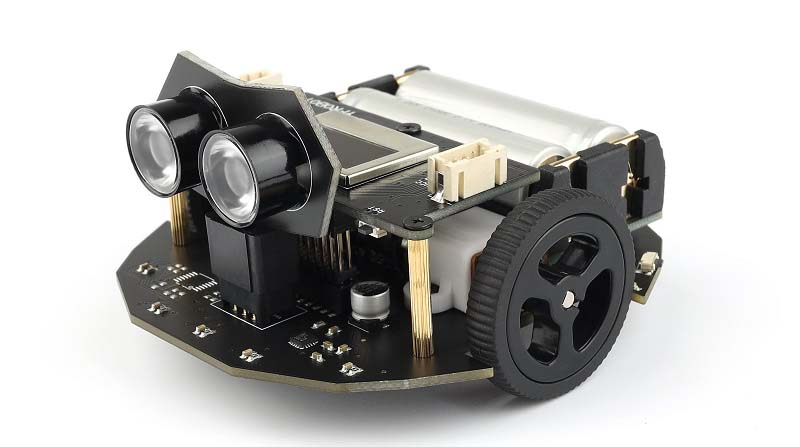

# Yfrobot-VALON-I3-Library
YFROBOT Motor Driver Library for VALON-I3

适配VALON-I3小车套件：VALON-I3_Arduino

适用对象：[VALON-I3](https://item.taobao.com/item.htm?id=622871845399)、[VALON-I3简介](http://www.yfrobot.com.cn/wiki/index.php?title=Arduino_Valon-I3)

#### Valon-I 使用说明：

创建对象：

`ValonI3 valoni3;`

Methods：

初始化

`valoni3.begin(VALONI3_ADDRESS) `

使能红外壁障

`valoni3.EnBarrier();  // 使能红外壁障传感器`

禁用红外壁障

`valoni3.DisBarrier();  // 禁用红外壁障传感器`

驱动电机，参数：电机速度 -255 ~ 255

`valoni3.setMotor(0, 0);`

读取红外壁障传感器，参数：BarrierL、BarrierR

`valoni3.readBarrier(BarrierR)`

#### 库版本说明：

*  V0.0.1 初始版本-20240510